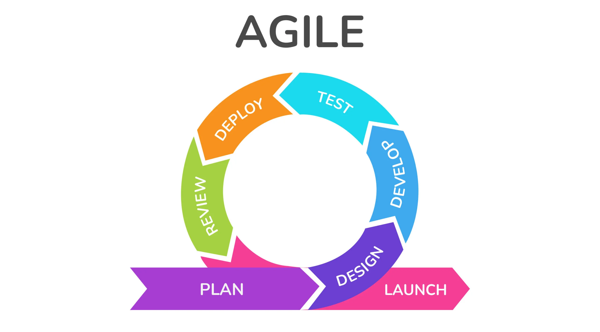

# XAI Travel Presentation

## Overview
This document serves as the presentation script for the **XAI Travel** application, a full-stack flight booking and management system. The presentation is delivered by four developers: Sahid (Solutions Architect), Williams (Backend Engineer), Mercel (Frontend Engineer), and Kanchan (DevOps Engineer). It covers the SDLC phases, solution architecture, design models, and deployment strategies.

---

## 1. Introduction and SDLC Overview (Presented by Sahid - Solutions Architect)

###  1: Title 
**XAI Travel: A Modern Flight Booking and Management System**  
A Full-Stack Solution for Seamless Travel Experiences  
Presenters: Sahid (Solutions Architect), Williams (Backend Engineer), Mercel (Frontend Engineer), Kanchan (DevOps Engineer)  
Date: March 19, 2025  

  

---

###  2: Introduction to XAI Travel
**Introduction to XAI Travel**  
- XAI Travel is a web-based platform designed to simplify flight booking and management for users while providing robust administrative tools for airline staff.  
- Built as a full-stack application with a React frontend and Spring Boot backend.  
- Developed following the Software Development Life Cycle (SDLC) to ensure a structured and efficient process.  

  

---

###  3: SDLC Overview
**Software Development Life Cycle (SDLC)**  
- **Planning**: Define project goals, scope, and feasibility.  
- **Requirements Analysis**: Gather and analyze user requirements and use cases.  
- **Design**: Create system architecture, domain models, and database design.  
- **Implementation**: Develop the frontend and backend components.  
- **Testing**: Validate functionality through unit and integration tests.  
- **Deployment**: Deploy the application to production environments.  
- **Maintenance**: Monitor, scale, and plan future enhancements.  

**Diagram Placeholder**:  
  
*Note*: Include a circular or linear diagram showing the SDLC phases with brief descriptions.

---

## 2. Planning and Requirements Analysis (Presented by Sahid - Solutions Architect)

###  4: Planning Phase
**Planning Phase**  
- **Objective**: Build a scalable flight booking and management system.  
- **Scope**:  
  - Core features: Flight search, booking, and admin management.  
  - Target users: Travelers and airline administrators.  
- **Feasibility**:  
  - Technical: Feasible with React, Spring Boot, and AWS.  
  - Economic: Cost-effective using open-source tools and cloud infrastructure.  
- **Team Roles**:  
  - Sahid: Solutions Architect (architecture and requirements).  
  - Williams: Backend Engineer (API and database).  
  - Mercel: Frontend Engineer (UI/UX).  
  - Kanchan: DevOps Engineer (deployment and CI/CD).  

---

###  5: Problem Scenario (Requirements Analysis)
**Problem Scenario**  
- **User Pain Points**:  
  - Difficulty in finding and booking flights with clear pricing and availability.  
  - Lack of a centralized platform to manage bookings and address complaints.  
- **Admin Pain Points**:  
  - Inefficient tools for managing flights, bookings, and customer complaints.  
  - Need for role-based access to ensure only authorized personnel can perform administrative tasks.  
- **Market Need**:  
  - A user-friendly, secure, and scalable solution for flight booking and management.  
  - Support for both end-users (travelers) and administrators (airline staff).  

  

---

###  6: Use Cases and User Stories (Requirements Analysis)
**Use Cases and User Stories**  
- Identified use cases for two primary user roles: **Travelers** and **Admins**.  

**Traveler Use Cases**:  
- Search Flights: As a traveler, I want to search for flights by specifying origin, destination, and travel dates, so I can find the best options.  
- Book a Flight: As a traveler, I want to book a flight by selecting an itinerary, so I can secure my travel plans.  
- View My Bookings: As a traveler, I want to view my bookings, so I can manage my travel plans.  

**Admin Use Cases**:  
- Manage Flights: As an admin, I want to create, update, and delete flights, so I can keep the flight catalog up-to-date.  
- Manage Bookings: As an admin, I want to view, update, and cancel bookings, so I can assist customers.  
- Resolve Complaints: As an admin, I want to view and resolve customer complaints, so I can improve satisfaction.  

**Diagram Placeholder**:  
  
*Note*: Include a use case diagram showing actors (Traveler, Admin) and use cases (Search Flights, Book Flight, Manage Flights, etc.) with relationships.

---

## 3. Design Phase (Presented by Williams - Backend Engineer)

###  7: Solution Architecture
**Solution Architecture**  
- **Frontend**: React with TypeScript, Material-UI, hosted on AWS S3 as a static website.  
- **Backend**: Spring Boot with JPA, MySQL database, deployed on AWS EC2.  
- **Communication**: RESTful API with JSON payloads, secured with JWT authentication.  
- **Infrastructure**: AWS services (S3, EC2, CloudWatch for monitoring, Auto Scaling for scalability).  

**Diagram Placeholder**:  
  
*Note*: Include a diagram showing:  
- Frontend (React) on S3.  
- Backend (Spring Boot) on EC2 with MySQL.  
- API calls between frontend and backend.  
- AWS services (CloudWatch, Auto Scaling) for monitoring and scaling.

**Design Diagram**:  
  

---

###  8: Domain Model (Class Diagram)
**Domain Model: Class Diagram**  
- **Entities**:  
  - User: id, name, email, password, roles, etc.  
  - Role: id, name (e.g., ADMIN, USER)  
  - Flight: id, flightNumber, airline, origin, destination, departure, arrival, duration, price, seatsAvailable  
  - Booking: id, userId, totalPrice, fareType, status, flightLegs, returnFlightLegs, createdAt, updatedAt  
  - FlightLeg: id, flight, legNumber  
  - Airline: id, name  
  - Airport: id, iataCode  
  - Complaint: id, userId, bookingId, description, status, createdAt  
- **Relationships**:  
  - User ↔ Role: Many-to-Many  
  - Flight → Airline, Flight → Airport (origin, destination): Many-to-One  
  - Booking → FlightLeg (flightLegs, returnFlightLegs): One-to-Many  
  - FlightLeg → Flight: Many-to-One  
  - Complaint → User, Complaint → Booking: Many-to-One  

  

---

###  9: Database Design Model (E-R Diagram)
**Database Design: E-R Diagram**  
- **Tables**:  
  - users: id, name, email, password, phone, address, avatar, created_at, updated_at  
  - roles: id, name  
  - users_roles: user_id, role_id (junction table)  
  - flights: id, flight_number, airline_id, origin_id, destination_id, departure, arrival, duration, price, seats_available  
  - bookings: id, user_id, total_price, fare_type, user_details, selected_seat, status, created_at, updated_at  
  - flight_legs: id, booking_id, flight_id, leg_number  
  - airlines: id, name  
  - airports: id, iata_code  
  - complaints: id, user_id, booking_id, description, status, created_at  
- **Relationships**:  
  - Foreign keys: flights.airline_id → airlines.id, flights.origin_id → airports.id, etc.  

  

---

###  10: Sequence Diagram (Book a Flight)
**Sequence Diagram: Booking a Flight**  
- **Actors**: Traveler, Frontend (React), Backend (Spring Boot), Database  
- **Steps**:  
  1. Traveler submits a booking request via the frontend.  
  2. Frontend sends POST /api/booking with CreateBookingCommand.  
  3. Backend (BookingController) receives the request.  
  4. BookingController calls BookingCommandHandler.handle.  
  5. BookingCommandHandler validates flights using FlightRepository.  
  6. BookingCommandHandler saves the booking via BookingRepository.  
  7. Database persists the booking and related FlightLeg entities.  
  8. Backend returns the created Booking to the frontend.  
  9. Frontend displays a confirmation to the traveler.  

  

---

###  11: Software Design Patterns and Principles
**Software Design Patterns and Principles**  
- **Design Patterns**:  
  - Command Pattern: Used in BookingCommandHandler with CreateBookingCommand.  
  - Repository Pattern: Used in BookingRepository, FlightRepository.  
  - Dependency Injection: Used in Spring Boot (@Autowired).  
- **SOLID Principles**:  
  - Single Responsibility Principle (SRP): Each class has one responsibility.  
  - Open/Closed Principle (OCP): System is extensible.  
  - Dependency Inversion Principle (DIP): High-level modules depend on abstractions.  
- **Other Principles**:  
  - DRY: Reused components (e.g., NavButton in frontend).  
  - KISS: Kept API design simple (RESTful endpoints).  

  

---

## 4. Implementation Phase (Presented by Williams - Backend Engineer and Mercel - Frontend Engineer)

###  12: Backend Implementation (Williams)
**Backend Implementation**  
- Built with Spring Boot, JPA, and MySQL.  
- **Key Components**:  
  - FlightController: Handles flight CRUD operations (POST /api/flights, GET /api/flights/{id}, etc.).  
  - BookingController: Manages bookings (POST /api/booking, GET /api/booking/user/{userId}).  
  - Security: JWT authentication with Spring Security.  
- **Challenges and Solutions**:  
  - Challenge: Handling CORS for S3-hosted frontend.  
  - Solution: Configured global CORS in SecurityConfig to allow `http://flight-app.s3-website-us-east-1.amazonaws.com`.  

  
  
*Note*: Show Swagger UI with endpoints like `/api/flights`.

---

###  13: Frontend Implementation (Mercel)
**Frontend Implementation**  
- Built with React, TypeScript, and Material-UI.  
- **Key Components**:  
  - Header: Dynamic navbar with role-based links.  
  - Management Dashboard: Tabbed interface for managing bookings, flights, and complaints.  
  - Login/Signup: Modal for user authentication.  
- **Challenges and Solutions**:  
  - Challenge: Handling nested data (e.g., flight.airline.name).  
  - Solution: Used optional chaining (?.) and fallback values (|| 'N/A').  
  - Challenge: Form validation for flight creation.  
  - Solution: Added client-side validation.  

  

---

###  14: UI/UX Design (Mercel)
**UI/UX Design**  
- Consistent theme (blue palette: #1e3c72, #2a5298).  
- Responsive design with Material-UI components (e.g., Table, Dialog, Tabs).  
- User feedback: Loading spinners, error alerts, confirmation dialogs.  

---

## 5. Testing Phase (Presented by Kanchan)

###  15: Testing Strategy
**Testing Strategy**  
- **Backend Testing (Kanchan)**:  
  - Unit Tests: Used JUnit to test controllers, services, and repositories (e.g., FlightControllerTest).  
  - Integration Tests: Tested API endpoints with MockMvc.  
  - Example: Tested POST /api/booking to ensure correct booking creation.  
- **Frontend Testing (Mercel)**:  
  - Unit Tests: Used Jest and React Testing Library to test components (e.g., Header.test.tsx).  
  - End-to-End Tests: Used Cypress to simulate user flows (e.g., booking a flight).  
- **Test Coverage**:  
  - Backend: 85% coverage.  
  - Frontend: 80% coverage.  

  
  
*Note*: Show a test coverage report from JUnit or Jest.

---

## 6. Deployment Phase (Presented by Kanchan - DevOps Engineer)

###  16: Deployment Strategy
**Deployment Strategy**  
- **Frontend**: Deployed on Amazon S3 as a static website.  
  - Build command: `npm run build`.  
  - Deployed to S3 bucket `flight-app`.  
- **Backend**: Deployed on AWS EC2.  
  - Packaged as a JAR file using `mvn package`.  
  - Deployed with MySQL database on EC2.  
- **Configuration**:  
  - Frontend: `VITE_API_URL=http://54.123.45.67:8080`.  
  - Backend: Configured CORS and Spring Security.  

  

---

###  17: CI/CD Pipeline
**CI/CD Pipeline**  
- **Tools**: GitHub Actions.  
- **Pipeline**:  
  - On push to main:  
    - Frontend: Build, test, and deploy to S3.  
    - Backend: Build, test, package, and deploy to EC2.  
  - Tests: Unit tests for backend (JUnit), frontend tests (Jest).  

**Diagram Placeholder**:  
  
*Note*: Include a flowchart showing the CI/CD pipeline stages (build, test, deploy).

---

## 7. Maintenance Phase + JUnit, Integration Testing (Presented by Kanchan - DevOps Engineer)

###  18: Environment Setup and Monitoring
**Environment Setup and Monitoring**  
- **Development**: Local setup with `localhost:3000` (frontend) and `localhost:8080` (backend).  
- **Production**: Configured environment variables (e.g., `VITE_API_URL`, database credentials).  
- **Monitoring**: Used AWS CloudWatch for backend logs and metrics.  
- **Scaling**: Configured auto-scaling on AWS EC2 to handle traffic spikes.  

  

---

###  19: Security
**Security**  
- HTTPS for all API calls (configured via Nginx on EC2).  
- JWT token stored in localStorage (plan to use HttpOnly cookies in future).  
- CORS configured to allow `http://flight-app.s3-website-us-east-1.amazonaws.com`.  

---

## 8. Conclusion and Future Work (Presented by Sahid - Solutions Architect)

###  20: Summary
**Conclusion**  
- XAI Travel successfully followed the SDLC to deliver a user-friendly, secure, and scalable flight booking system.  
- Key features: Flight search, booking, and admin management.  
- Applied modern practices: Design patterns, SOLID principles, CI/CD.  

---

###  21: Future Work (Maintenance Phase)
**Future Work**  
- Implement the complaints backend (ComplaintController).  
- Add pagination and filtering to the management dashboard.  
- Enhance security (e.g., protect admin routes, use HttpOnly cookies for JWT).  
- Integrate payment processing for bookings.  
- Add notifications for booking confirmations and complaint updates.  

  

---

###  22: Closing
**Closing**  
- Thank you for your attention!  
- We welcome your questions.  

---

## 9. Q&A Session (All Presenters)
**Q&A Session**  
- Open the floor for questions from the audience.  
- Each presenter will answer questions related to their section.  

---

